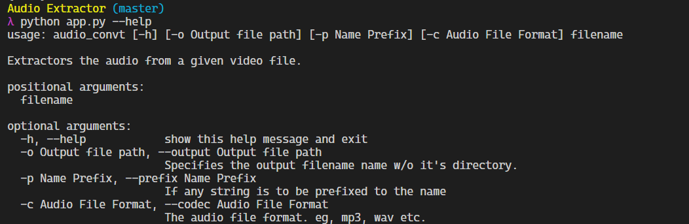

# Audio Extractor
The script that extracts the audio out of a given video file.

___

## Usage
    python3 app.py -p <prefix text> -c <codec (default: mp3)> -o <output path> <source file (required)>

### Help

___

## Installation
Run the following commands
    
    virutalenv venv
    pip install -r requirements.txt

Run the application as stated in the Usage Section above.
___

## About
This project was written in `Python3` and using primarily the `MoviePy` package.

### Disclaimer 
This was fun project and in no sense a professional project. You may build on this project freely and if you want to improve on this feel free to drop in a pull request.
